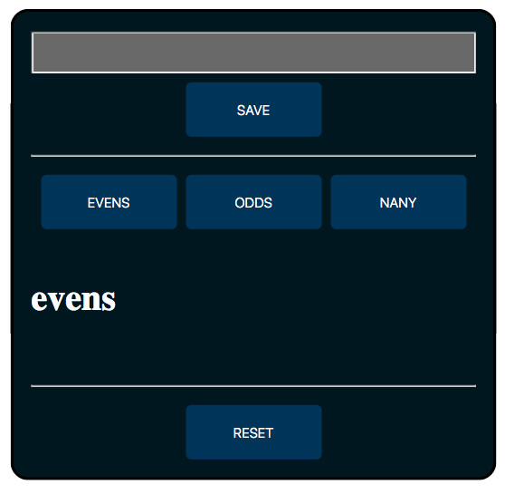

# Even or Odd

> Starter Code exercises to practice javascript coding and learn how to build and use a data model to save the state of the webpages, complete exercise with listeners, handlers, data, init load and logging.

## Table of contents
* [General info](#general-info)
* [Screenshots](#screenshots)
* [Technologies](#technologies)
* [Setup](#setup)
* [Features](#features)
* [Status](#status)
* [Inspiration](#inspiration)
* [Contact](#contact)

## General info
The purpose of the project is to continue learning and using javascript on webpages, use data structures of the javascript language to save the state of webpages.

## Screenshots

## Technologies
* HTML5
* CSS3
* git
* javascript

## Setup
You can clone or fork this repository and test the files.

## Features
The project features a web site with:
* Input box to allow the user save content from the input field to the `strings` data object.
* Save button to store input text into data object `strings` with data `evens` array for all even numbers, `odds` array for all odds numbers and `NaNy` array for the string type inputs, it must not allow to store duplicate values.
* Evens button to display on screen a header and a list with the values stored in the `strings` object's `evens` array.
* Odds button to display on screen a header and a list with the values stored in the `strings` object's `odds` array.
* NaNy button to display on screen a header and a list with the values stored in the `strings` object's `NaNy` array.
* Reset button to clear data object and restore initial values.

## Status
Project is: finished, final version.

## Inspiration
[this repository](https://github.com/HackYourFutureBelgium/numbery-and-nany)

## Contact
Created by [@ferrycosv](www.github.com/ferrycosv) - feel free to contact me!